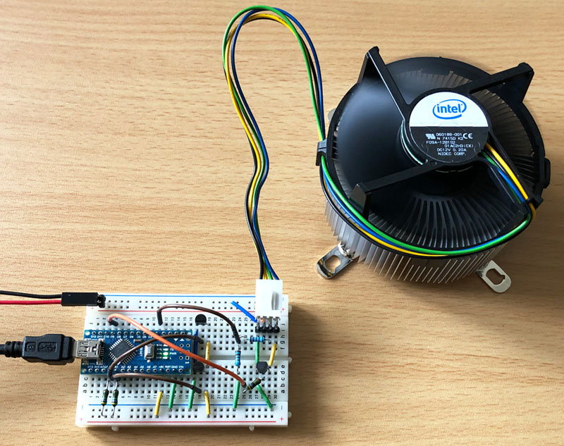
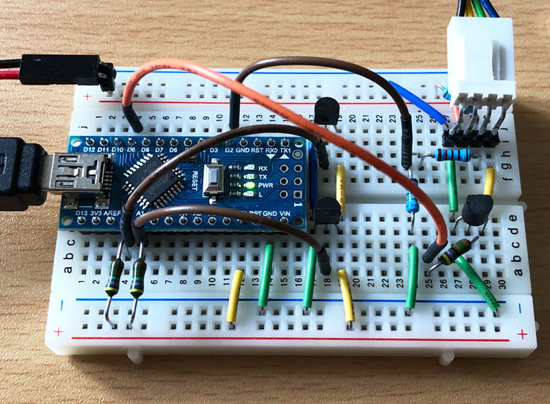

# Argus Controller

- Argus Monitor supports Open Hardware circuits to use additional custom temperature sensors and fan control channels within the program.
- We call these devices Argus Controller.
- At least Argus Monitor version 5.0.4 is required for these.

## Description

We have made an [example](ArduinoNanoExample1) to demonstrate such a device with the help of the very common Arduino Nano or Arduino Uno platform. 
The example demonstrates the creation and set-up of temperature channels and fan control channels. 
We show here a hardware solution for the popular Dallas DS18B20 temperature sensors and for connecting 4-pin pwm controlled fans. 
With additional circuitry and software changes, you could control 3-pin voltage controlled fans also or use different  temperature sensors.  
You can adapt the hardware to your needs, built it around a completely different microcontroller, change the number of  temperature and fan control channels and so on. 
Each hardware device can have up to 6 temperature channels and 6 fan control channels. 
Argus Monitor will detect and use any such device as long as the serial communication protocol (see below) is respected. 

[:us: Detailed HW/SW description (English)](https://help.argusmonitor.com/ArgusController.html)

[:de: Detaillierte HW/SW Beschreibung (Deutsch)](https://hilfe.argusmonitor.com/ArgusController.html)

## Communication protocol

todo

## Lizenz

**Creative Commons BY-SA** 
Give Credit, ShareAlike

 This work is licensed under a <a rel="license" href="http://creativecommons.org/licenses/by-sa/4.0/">Creative Commons Attribution-ShareAlike 4.0 International License</a>.
